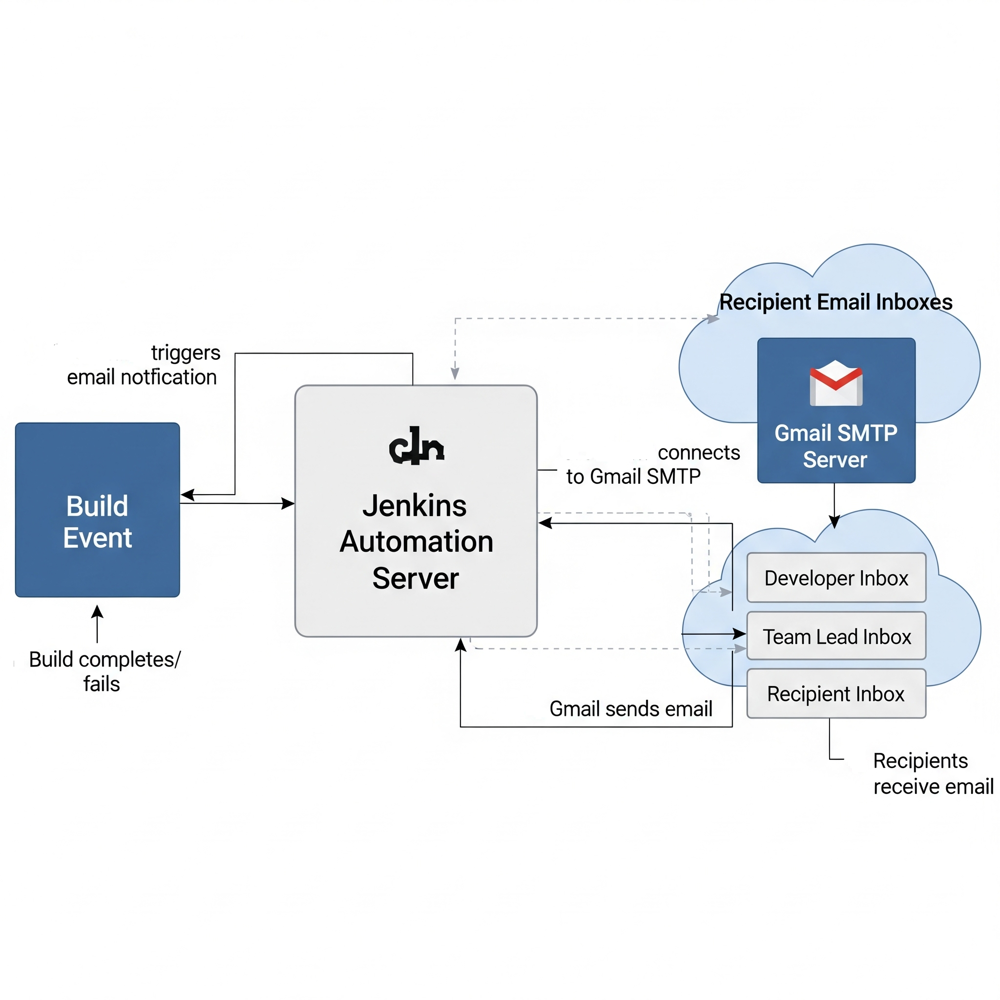
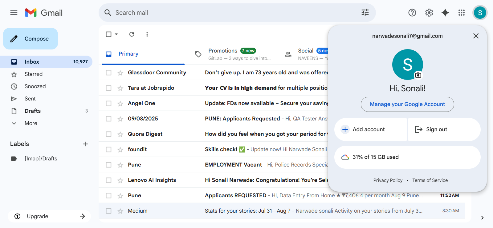
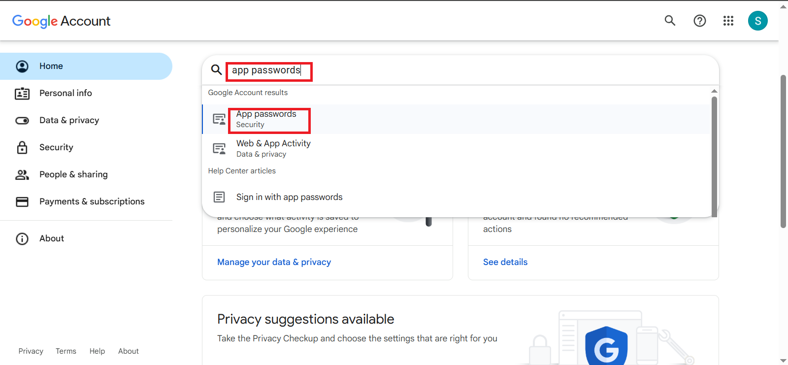
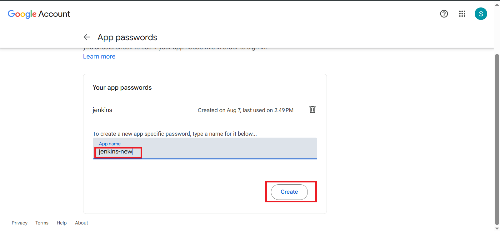
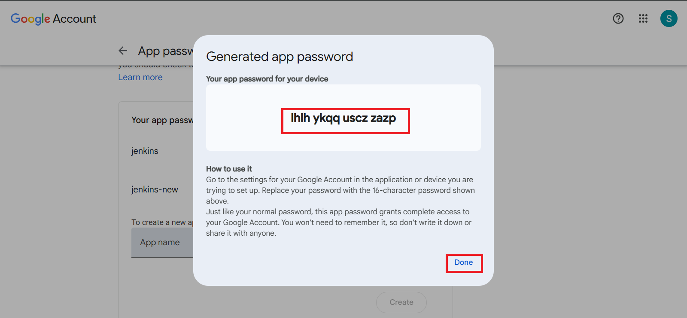
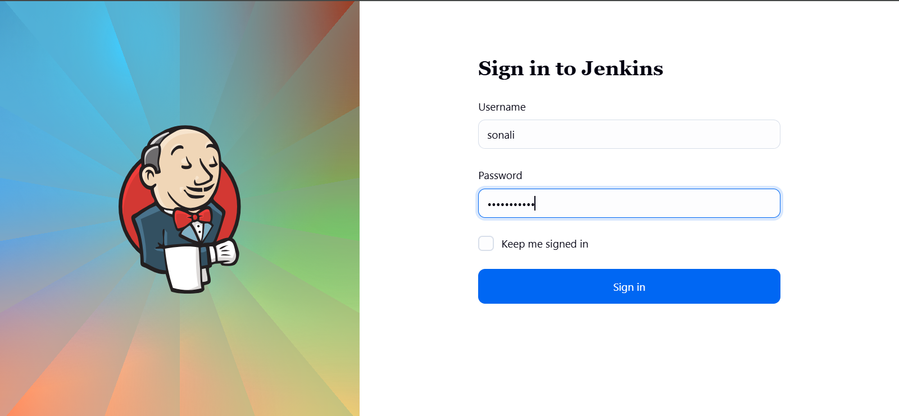
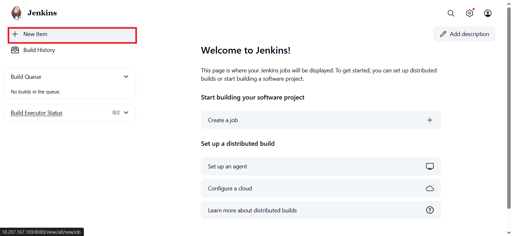
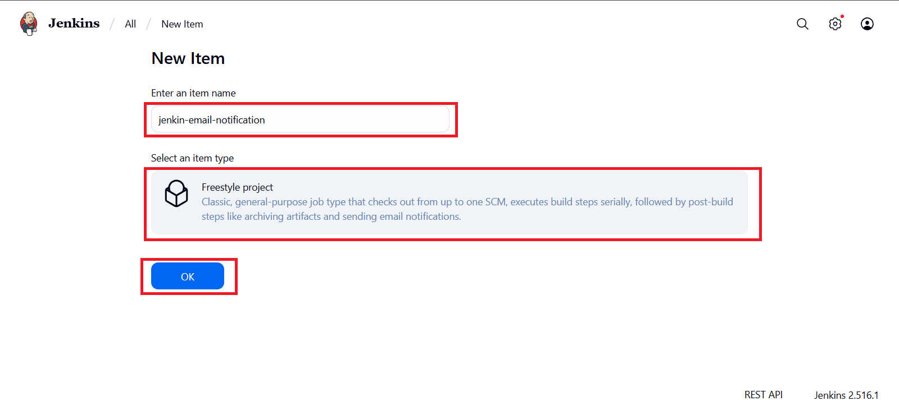
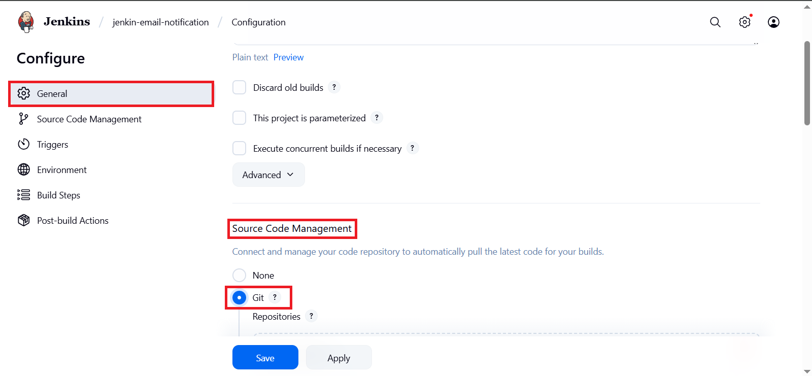

# 🚀Jenkins Email Notification Setup with Gmail SMTP (Step-by-Step Guide)

Email notifications are one of the most useful features in Jenkins, especially when you want to be instantly informed about the success or failure of your builds. 
In this guide, we will walk through configuring Jenkins to send email alerts using Gmail SMTP.
By the end of this tutorial, your Jenkins server will be able to automatically send emails whenever a build fails, becomes unstable, or succeeds.

----
## 1. Why Email Notifications in Jenkins?
When working in a CI/CD environment, it’s crucial to stay updated about your build status without constantly monitoring Jenkins. Email notifications allow you to:

- Get alerts for failed builds with error details.

- Receive confirmation for successful builds.

- Keep the entire team informed about the build status.

- Save time by focusing only when there’s an issue.

---
## 2. Prerequisites
Before starting, ensure you have:

- Jenkins installed and running.

- A Gmail account.

- Internet access from your Jenkins server.

- Installed the Email Extension Plugin (if you want more advanced formatting and triggers).
--- 
## 3. Architecture Diagram
Below is the high-level flow of how Jenkins sends an email notification through Gmail SMTP:



---
## 4. Enable App Password in Gmail
Since Google now blocks “less secure apps,” you cannot directly use your Gmail password in Jenkins. Instead, we generate an App Password.

- Open Gmail and click on your profile picture in the top-right corner.

- Click Manage your Google Account.



- In the search bar, type App passwords.



- Click App passwords.

- Enter your Gmail password if prompted.

- Under “Select app,” choose Other (Custom name) and enter:
- Click Create.


```
jenkins
```
- Google will generate a 16-character app password (example: lswevyqjmaoreqkf).

- Copy this password and keep it safe — you will need it for Jenkins.



- If the option for app passwords is not available, enable 2-Step Verification in your Google account first.
---
## 5. Configure Jenkins Email Notification
### Step 1: Open Jenkins Dashboard
- Login to your Jenkins dashboard.


## 6. Create a Job with Email Notification
### Step 1: Create a New Job
- From the Jenkins dashboard, click New Item.



- Enter a job name:

```
jenkin-email-notification
```
- Choose Freestyle Project and click OK.


### Step 2: Add Source Code Management (Optional)
- Under Source Code Management, select Git if you have a repository to build.



---
## Step 3: Configure Post-Build Actions
- Scroll down to Post-build Actions.

- Click Add post-build action → E-mail Notification.

- In Recipients, enter the email addresses you want to notify (separated by spaces).

- Tick Send e-mail for every unstable build (you can also choose only for failures).

- Click on Save.
---

### Step 4: Go to System Configuration
- Click Manage Jenkins → System.

### Step 5: Set Global SMTP Settings
In the E-mail Notification section:
- SMTP server:
```
smtp.gmail.com
```
- Click Advanced.
- Tick Use SMTP Authentication.

- User Name: Your Gmail address (example:   narwadesonali7@gmail.com).

- Password: Your generated App Password.

- Tick Use SSL.

- SMTP Port:
```
465
```
---
### Step 6: Test the Email
- In the Test e-mail recipient field, enter your Gmail address.

- Click Test Configuration.
- If everything is correct, you should receive a test email.

- Click Save.
---

## 7. Testing the Setup
- Go to your job’s page.

- Click Build Now.

- If your build fails, you will receive an email with the error message.

- If your build succeeds, you will receive a success notification.
---
## 8. Example Email Alerts
- Failed Build Email – Contains:

- Job name.

- Build number.

- Error message/logs.

- Successful Build Email – Contains:

- Job name.

- Build number.

- “Build Successful” status.
---
## 9. Troubleshooting
- If emails are not being sent:

- Ensure App Password is correct.

- Verify SMTP settings.

- Check Jenkins server firewall rules — port 465 must be open.

- Review Jenkins logs for any javax.mail errors.

- Make sure your Gmail account is not blocking suspicious sign-ins.
---
## Conclusion
Setting up Jenkins Email Notifications with Gmail SMTP ensures you’re always in the loop about your CI/CD pipeline’s status.
This is a vital step in making your development process more responsive and collaborative.

With this setup, you’ll no longer need to constantly check Jenkins — the build results will come directly to your inbox.

---


